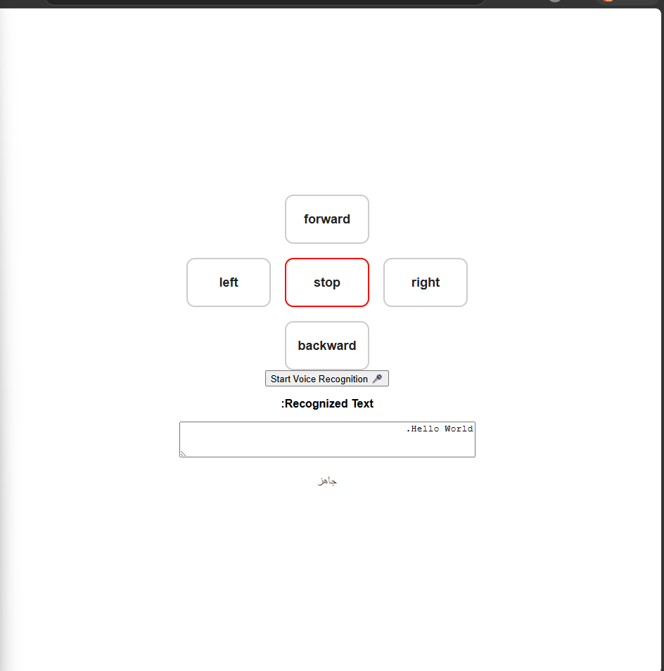
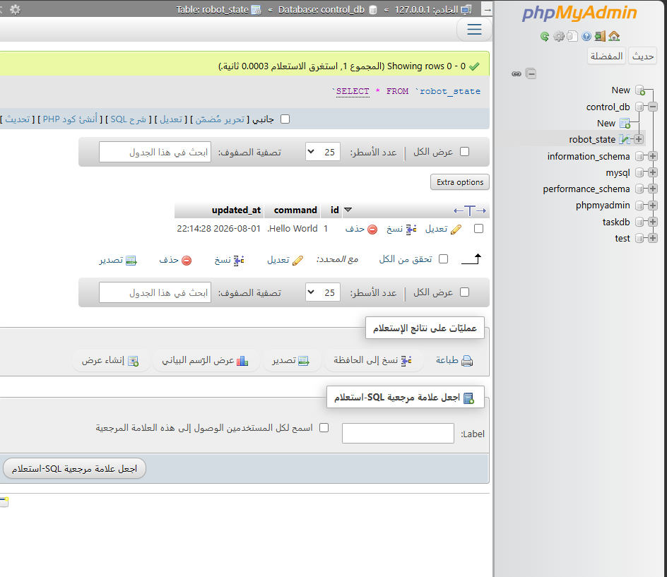
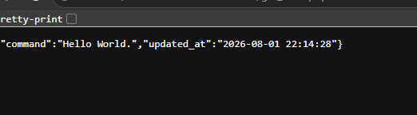

# Robot-Control-Panel

## Overview

This project is a web-based robot control panel developed using HTML, CSS, JavaScript, PHP, and MySQL. It provides a control interface for robot movement and integrates Speech-to-Text functionality. The recognized speech is stored in a MySQL database, allowing commands or spoken text to be saved for further processing.

## Features

- Robot movement control panel.
- Speech-to-Text using the browser's Speech Recognition API.
- Store recognized speech in a MySQL database.
- PHP backend for handling requests.
- MySQL database integration.

## Technologies Used

- HTML
- CSS
- JavaScript
- PHP
- MySQL
- XAMPP

## Project Structure

```
Robot-Control-Panel/
│── index.html
│── db.php
│── update_command.php
│── setup.sql
│── esp32_code.ino
│── README.md
├── interface.png
├── database.png
├── getstate.png
```

## Setup

1. Copy the project folder to the `htdocs` directory in XAMPP.
2. Start Apache and MySQL.
3. Create a MySQL database.
4. Import the `setup.sql` file using phpMyAdmin.
5. Update the database credentials in `db.php`.
6. Open the project in your browser.

## Screenshots

### User Interface



### Database



### Get State API
get_state.php


